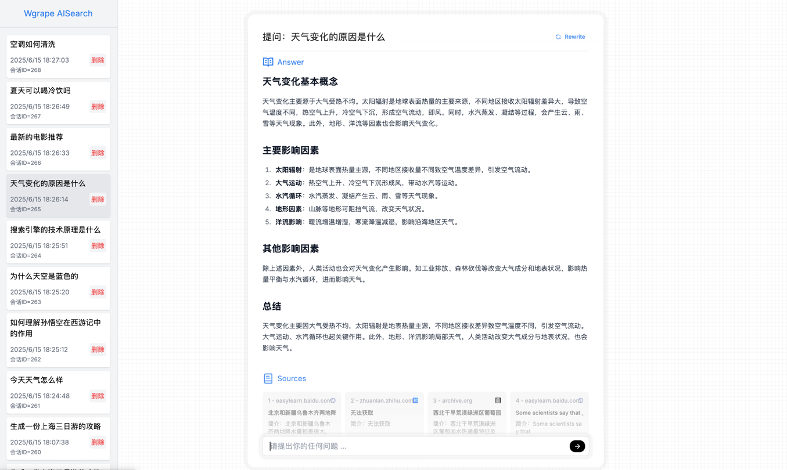

# aisearch
AI搜索项目

## 一、运行效果

### 1、首页


### 2、搜索结果页


## 二、前端部署

### 1、项目配置

前端项目启动后，会默认请求地址为 ```http://127.0.0.1:8100/``` 的后端服务。所以后端服务默认启动后也是8100端口，如果修改了后端服务的端口，请对应修改前端项目的配置。

### 2、启动服务

```bash
cd web && npm install && npm run build

# 上述命令如果启动失败，则可以在当前窗口执行本地启动命令。
npm run dev
```

前端部署成功后，访问 http://127.0.0.1:3000/ 即可。

## 三、后端部署

### 1、安装wpylib依赖

本项目依赖[wpylib](https://github.com/WGrape/wpylib)库，运行所需要的版本号已标注在[requirements.txt](./requirements.txt)文件中。此外，需要注意的是，[wpylib](https://github.com/WGrape/wpylib)项目如无重大问题，将不再更新。如果后续有更新，仅发布在```0.{次版本号}.{修订号}```版本号下，且只发布在pip平台下，点击[查看地址](https://pypi.org/project/wpylib/)。

### 2、启动Milvus
```bash
# Download the configuration file
wget https://github.com/milvus-io/milvus/releases/download/v2.5.13/milvus-standalone-docker-compose.yml -O docker-compose.yml

# Start Milvus
sudo docker compose up -d

# Creating milvus-etcd  ... done
# Creating milvus-minio ... done
# Creating milvus-standalone ... done
```

### 3、部署本地模型
先下载 [ollama](https://ollama.com/) 工具，然后搜索模型，进行下载即可。
```bash
# 下载部署deepseek对话模型
ollama run deepseek-r1:8b

# 下载部署nomic嵌入模型
ollama run nomic-embed-text:v1.5
```

### 4、配置langfuse
请前往 [langfuse](https://cloud.langfuse.com/) 官网，注册账号并创建项目。在项目中获取 API secret_key 和 public_key ，并在 config/{env}/config.yml 配置文件中修改 langfuse 对应配置即可。

### 5、申请搜索引擎秘钥
请按照流程申请 Bing 搜索引擎服务，并在获取秘钥后，修改 config/{env}/config.yml 配置文件中的 bing_subscription_key 配置即可。

### 6、部署本地数据库
如果没有安装 MySQL，请先安装 MySQL 数据库，并在 config/{env}/config.yml 配置文件中修改 database 数据库配置即可。

### 7、启动服务

```bash
python src/main.py --dir=~/github/aisearch --env=test
```

后端部署成功后，访问 http://127.0.0.1:8100 即可。
